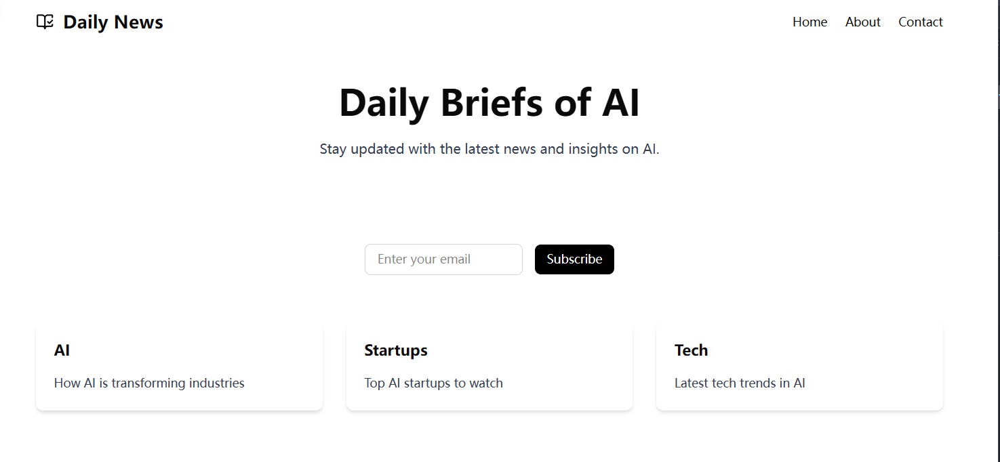

# Daily Briefs of AI



A daily AI news briefing platform that delivers the latest AI insights directly to your inbox.

## Core Features

- **Daily AI News**: Curated AI news and insights delivered daily
- **Email Subscription**: Subscribe to receive daily briefings
- **Three Key Topics**: AI, Startups, and Tech trends coverage

## Tech Stack

- **Framework**: Next.js 16 (App Router)
- **Language**: TypeScript
- **Styling**: Tailwind CSS 4
- **Email Service**: Resend
- **Task Queue**: Inngest
- **RSS Parsing**: rss-parser
- **UI Components**: shadcn/ui (Sonner)

## Prerequisites

⚠️ **Important**: You must have your own custom domain configured to send emails. This is required by email service providers for proper DNS and SPF/DKIM authentication.

**Domain Recommendation**: You can purchase a domain from [硅云 (GICloud)](https://www.gicloud.com) - a reliable Chinese domain registrar.
* free domain registration*

## Getting Started

1. Install dependencies:
```bash
npm install
# or
bun install
```

2. Set up environment variables (create `.env.local`):
```env
INNGEST_EVENT_KEY=your_inngest_event_key
INNGEST_SIGNING_KEY=your_inngest_signing_key
RESEND_API_KEY=your_resend_api_key
```

3. Run the development server:
```bash
npm run dev
```

Open [http://localhost:3000](http://localhost:3000) to see the result.

## Deployment

This project is ready for deployment on [Vercel](https://vercel.com):

1. Push your code to GitHub
2. Import your repository on Vercel
3. Add environment variables in Vercel dashboard
4. Deploy

## Learn More

- [Next.js Documentation](https://nextjs.org)
- [Inngest Documentation](https://www.inngest.com)
- [Resend Documentation](https://resend.com)
